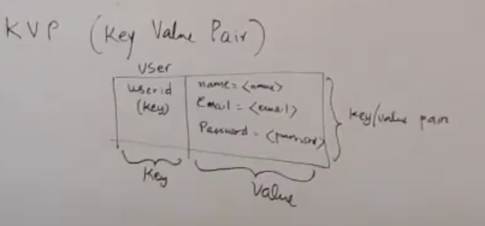

# Cloud Design Pattern
https://docs.microsoft.com/en-us/azure/architecture/patterns/

# SSO
https://www.loginradius.com/blog/2019/05/what-is-single-sign-on/

# Scalable system problems
- Parallel requests
- Geo location
- Data size limitation
- Single point of failure 
- Server hotspot
- Data hotspot
# Building blocks
## App server behind the a load balancer

It tried to solve following problems
- Parallel requests
- Server hotspot 
- Single point of failure, typically load balancer doesn't fail. To take care of failure, a backup load balancer is designed which take care of single point of failure 

## Data replication

- Parallel requests
- Geo location limitations
- Single point of failure
## Data sharding
This is kind of partitioning. Following are different ways to partition your data
- Column wise partition
- Row wise partition
- Cell wise partition

Sharding is partition by row.

It solves following problem
- Data size limitations
- Parallel request limitations
- Data hotspot (at some extent)
## Caching
It solves following problem
- Data hotspot (specially read)
- Parallel requests
- Geo locations (building caches across the globs)

# Micro Services Design pattern
- It is collection of loosly coupled services
- it is derivative of service oriented architecture
- Key thing is to have loosly coupled
- Division of micro services is based on application functionality
- Able to scale individual services separately 

Following are benefits
- Keep lossly coupled
- Scale individual services separately. Both compute/storage

- Two micro services may shared same storage if required
- Breakup large system into smaller functional unit
- Keep it decoupled in deployment/scalable purpose

# Logical and physical storages
Logical schema of your storage needs to be discussed first.
## Logical storage
### Relational model
- Data is stored in table as row/column

### Key Value pair
- Old concepts to store data
- NoSQL goes with this approach

### Graph model
- As graph 

## Physical Storage
Irrespective of logical schema, data can be stored as row/column.
### Row family
### Column family
Introduced by many NoSQL database. It allows you to have separate physical storage for each column family.
This allows to group multiple related columns into single family. 

There are two major format to store data on disk.
### Row major format
- Way to RDBMS store data traditionally.
- Data is stored on disk in row format
- On disk, everything is based on offset
- To seek column, you have to scan entire row (drawback)
- max, min etc on certain column requirement is not optimized for row major format

### Column major format
- For each column family, there is separate set of storage
- Still disk storage is based on offset
- It allows to have different placement for different type of columns
- In this example, security column family for login users, where others are for users specifics
- It helps to optimize separate columns family differently based on needs
- For example, store security family on flash drive to access more faster compare to other
- max, min etc on certain column requirement is easy to implement i.e. have separate column family for min/max

## Indexing
- Disk retrieval is always based on exact match
- In most of the cases, primary key is based on hash indexes
### Hash index 
- support exact match
- It's nothing but a simple hash map
- While thing will be a file on disk
- Every time you want to access data of given user, you will have userid, seek the given userid and get the offset and retrieve from disk

### B Tree index
- This is used when you don't have exact value of the key you are looking for
- Also used for range based retreival
- B tree index is organized as n way tree (similar to binary search tree)
- first level will have the range of the key
- leaf level will have exact key
- For the given partial key, B tree is used to get the offset of data, which then used to get the data from original table
- This is also possible to do range retrieval, at the leaf node, one node will have pointer to point to the next leaf node. Once you reach to one leaf node, then you can utilize next pointer to get the next leaf and keep moving until match the criteria
### Combination index
- This is useful when you will more than one criteria to read the data
- One of the criteria is clearly demarking data well, and other are fuzzy
- For example, retrieval based on location and name, might given exact match by location (example US) and then list of names

## Sharding
Goals:
- Partition data horizontally
- Splits data into sets of rows
- near even distributions of data in shards
- Add new shards easily
- Shards are not available

Approaches
### Simplistic
Based on x%n where n is number of shards

### Consistent hashing

## Replication
- Entire data set is taken and copied over possbily different geographical location
- Each copy is called replica
- in distributed system, replica help to serve different geographical users near to location
- Allow multiple parallel request
- Very popular building block to help to design system
- Challenge is to make sure data remains consistent across the replicas
- Eventual consistencies
- Guranteed that all data will be consistent eventually
- Replica is the case where all copies are active
- This is not the case where one set is active and second is working as standby
- Here, its active active

### Sample scenario
- A sample schema with key/value
- On first replica, value changed at t1
- Once write happened then change replicated to other replicas i.e. there will be latency
- You need to plan for latency
- Another user on different geo location at t2, value is modified 
- At the end, there should be a consistent model to make sure change is replicated
#### Big issue is 
- Order of changes
- timestamp is one of the measurement to identify the order
- One assumption is, timestamp is consistent across the replica
- There is NTP protocol to make sure time is same
- This approach works fairly with RDBMS
- With 100TB, changes were working fine
- Recently, Block chain, BitCoin also tried to solve same problem, i.e. handle order of changes
- Still DB continue with timestamp due to volume of changes is huge in DB compare to block chain
- Most NoSQL has timestamp associated with each cell
- When write happend, it store value as well as timestamp
- It keeps last 3 write (have garbage collector to remove old)
- Every write is broadcasted to other replicas
- Each replicas compare the change timestamp, if recieved change is latest then it will add a copy
- If received change is old then it will discard it
- Old copies will be garbage collected
- Eventual consistenices is handled
- All of changes are kept separately in the change log
- Change log is either separate database or separate file
- You write in Change log as per timestamp
- Second step is to write into DB
- RDBMS support transaction, NoSQL doesn't
- Replication system has to transmit each change log to other replicas
- It look for status, if it is complete then it will forward to some message queue then it will be consumed by other replicas

There are two failure cases
1. Write to DB fail
    Discard the change.
2. Update to change log fail
    forward the change

# Consistency/Availability
- How consistency and availability play at application level. 
- If write happened on R1, but read request came to R3 before change are replicated, user will see old value
- This model in application point of view is not consistent i.e. read can get stale data
- In data point of view, it is eventual consistent, but application point of view it is not consistent
There are two model can be applied on application level
- Available model
- Consistent model

## Available model
- Less failure 
- It could result into stale reads
- Consistencies is not guarantee

## Consistent model
Goal is to maintain consistencies at application level. Following two approaches are applied
1. Quorum reads
2. Quorum writes
Quorum reads/writes are done at the database level. 
### Quorum Writes
- Database will write into majority of replicas
- Database knows how many replicas in the cluster
- Application doesn't know how many replicas
- 
### Quorum Reads
- DAtabase will read from majority of replicas
- At the DB level it know how many replicas and how to reach
- In all cases, if it founds more changes then pickup the latest
- Application will get latest change
- Downside is, availability is not guarantee. It needs majority of replcias to be reachable, which many not the case alawyas, so it will have to fail the request

R = number of replicas being used for read
W = number of replicas being used for write
R + W > N
It depends on your application on which between R/W needs to be small/high.
I.e. needs to define if application is read heavy or write heavy

### Partition tolerant
- In distributed system, geographically separate set of resources, connected using network
- some network interconnection can fail
- Your application should be tolerate the failure
- Partition tolerance is must of the application

## CAP Theorem
1. Consistent
2. Available
3. Partition tolerant
- You can only get two.
- Since partition tolerance is must, so you have to choose between Availablity and Consistency.
- Traditional RDBMS, has both C & A, but not partition tolerant

Example1
- Amazon with inventory of products
- You must need consistency model

Example2
- Twitter app where user post tweet and other retweet
- Number of retweet, you don't want to consistent
- Eventual consistent is fine
- Important is availbility 

# Caching
## Application cache
- Caching is separate layer to support your micro services. 
- When you have set up system, you will typically have different cache system.
- Sometime cache is available on all the level
- Sometime as a designer, you don't have access/design all the cache level
- For example, HTTP cache for request/response. You might have little control on cache ttl
## Storage level cache
- You can only have control on cache size

At your application level, you do have choice to build your cache level. It may not be used to directly send response or may not be tied to what would be stored in storage. 

Following are required to design a cache
- What is stored?
Typically a key/value pair. You have lot of commercially available cache for eg memcache, these are operational aspect.
1. Size
2. Type of cache
3. Physical topology
## Size
x % of total storage. 1% or 10%.
## Type of cache
1. Write through 
2. Write around
3. Write later 

### Write through 
- All write will go to cache
- Then saved into DB
- Read will go directly from cache
- If cache missed then it will read from DB and update cache
- App never talks to database directly
- You choose this approach when you manage caching using single source of data storage
- Cache has subset of schema in storage
- There should be reasonable volume, i,e it should not be read heavy and little of read or vice versa

### Write around
- All writes goes to storage
- Cache get populated later 
- App write into DB
- DB then write into cache (async)
- Cache could be written from different data source 
- App try to read from cache
- If cache miss then it goes to storage
- App might have to talk to multiple cache system if there is cache miss
- Cache miss become complicated
- In case of cache miss, need to populate it
- Cache updater service takes care of updating cache
- Real benefit is when cache is syntehsize from multiple data source

### Write later 
- Write goes into cache
- Read will come back from cache
- Later, write will save into storage
- If cache miss, then some other service will take care of reading data and populate
- Other compleixity, since data is not written into storage directly, therefore you might loose your data
- This is not a popular strategies

## Physical topology of Cache
Following are different options
1. Sharded
2. Replicated
3. Dedicated in app server or process

### Sharded

### Replicated

### Dedicated/App Server

# DB Comparison
Two major classes
1. RDBMS
2. NoSQL
## Feature/Capability comparison

# Map Reduce
Sample data

- Map reduce is required when we want processing on entire dataset
- In case of tweeter 200TB of data
- It's not possible to write one job to do all the things
- Job itself has to be sharded
- That's whole concept of map/reduce
- Map/Reduce provides bunch of stages of processing 

Q. Product manage wants following reports

Ans: 
If data size is small and entire data is stored in RDBMS/NoSQL then it is simple as below
- Apply transformation function on user's birthday to get age range
- Group by based on transformed user's birthday and then count(*) to get the result

That's what essentially map/reduce is going to do. Since we can't run SQL on 200TB then expect to return data on time. 
So only way to work is come up with stages to get the result
It has following 
## Mapper
- Each mapper is on one machine running the task
- It processes part of your input data
- It can have multiple mapper

To process 200TB of data, you can choose for example half TB of data to be processed by one mapper. 
You will need 400 machines to run mapper to process half TB of data each.
- Mapper takes input from Tweet table
- Every mapper produce output
- In Map/Reduce, its not like HashMap
- Its like multi map
- Same key can have multiple rows with different values
- Output will be flipped
- Same output from different mapper
## Shuffle phase
- It will take output from mapper as input
- It will also take user table (user table is also sharded)
- It will generate like table

- No one is waiting for these result
- It may take time
# Microservices pattern for Map/Reduce
# Stream processing
- Get stream of data
- You want to process and produce result on real time
- Batching of incoming item to avoid flux of incoming stream
- Or have time window to batch the messages 
- This pattern is called `micro batching`
# Micro Batching/Stream processing
Problem statement
- Capture and measure latency of some services
- You exposed micro services to accept the latency of services
Let's assume that we want to measure following
- count
- avg

- Apache storm is commercial available product

# Key design tools
- Micro Services
- Map/Reduce
- Micro Batching
# Hardware limitations
- Read QPS: 2000
- Write QPS: 200
- Storage: 2 to 3 TB
- 
